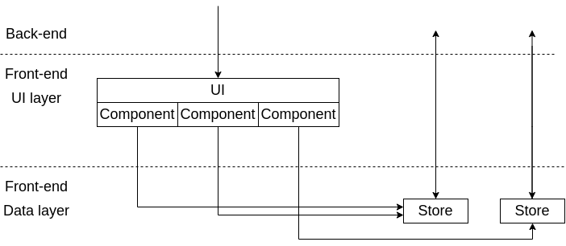
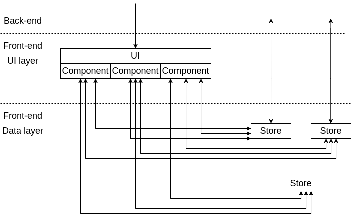
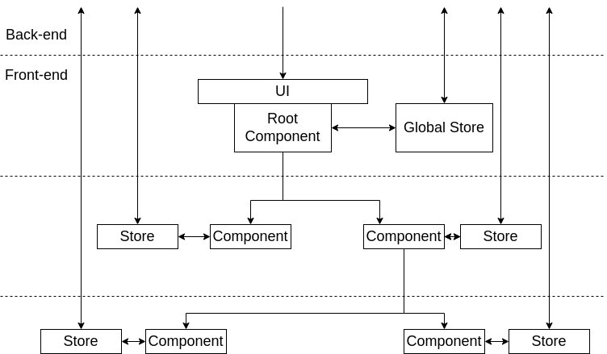

# Interactive multistores

Если ваша архитектура с единственным глобальным хранилищем перестала перестала справляться со сложностью проекта, то возможно пора переходить к архитектуре с множественными интерактивными хранилищами. Схематически такую архтектуру можно изобразить на следующей диаграмме так (Рис. 1):

*Рис.1 Interactive multistores ftont-end архитектура*

Стрелки обозначают возможность общения разных слоёв, иногда через дополнительные механизмы. Например, стрелка соединяющая хранилище из data layer и back-end может обозначать общение через дополнительный сервис или хук. Что может быть проще чем идея — если вам не хватает одного хранилища — вы всегда можете завести несколько, но более узкоспециализированных и предоставить для них доступ только тем компонентам системы,  которым этот доступ необходим. Таким образом можно значительно уменьшить зацеплённость компонент системы между собой. Если разные компоненты системы работают с разными данными(а так обычно и бывает на реальных проектах), то каждая команда компонента может использовать, без боязни нарушить работу всего приложения, своё собственное хранилище (или несколько таких хранилищ) и только если это необходимо — осторожно использовать общие хранилища с помощью которых происходит обмен информацией с другими частями системы. Какие преимущества данного подхода? Следующие:

1. Разработчики могут разрабатывать независимые части системы по настоящемы независимо, не мешая друг другу, и т. д. По сути это уже тот уровень когда мы на практически на полную катушку начать использовать общеизвестные паттерны и практики для монолитных приложений (и наконец начать говорить с back-end инженерами на одном языке). Обычно это помогает обслуживать систему с относительно постоянной скоростью (без значительного замедления со временем, что может происходить с усложнением проекта на single store архитектуре)
1. Само приложение становится более гибким и готовым к изменениям, в нем более ярко вырисовываются доменные области, появляются специфические для разных мест модели и интерфейсы, что опять таки облегчает разработку конкретных локальных фич.

Прекрасно, так почему же не отказаться от single store архитектуры? Преимущества по мысштабированию проекта не даются бесплатно:

1. Разработчики платят за это дополнительными абстрактными слоями, что неизбежно усложняем саму инженерную систему и требует более квалифицированных специалистов.
1. Система становится достаточно большой и чтоб сделать работу в разных частях консистентной придётся дополнительно инвестировать в поддержу подходов, например, нанять архитектора, проводить обмен знаниями между разными командами вести более детализированную документацию, что в целом часто не требуется для single store архитектур. Если этого не делать, то разработчики могут просто перестать видеть систему целиком.
1. Навык программиста по выделению разных доменов начинает играть тут значительную роль, что может удлинять онбординг новых специалистов (нужно больше время для погружения в специфику проекта).

Приведу небольшой пример того как быстро система может стать непредсказуемой с точки зрения поведения (Рис.2):

*Рис.2 Зарождающийся ball of mud*

Всего три компонента и три хранилища при неумелой эксплуатации превращаются в известный антипаттерн The ball of mud, когда связи в системе становятся хаотичными и непредсказуемыми. Уже сейчас (с просто примитивной системой) становится сложно разобраться по картинке куда ведет какая стрелка, что говорить про системы в которых насчитываются десятки компонент и хранилищ?! Задача программиста (и, конечно, архитектуры) совладать с этой нарастающей сложностью и сделать систему максимально прозрачной и предсказуемой. Тут подойдёт выделение дополнительных слоёв в приложении, использование подходов Domen Driven Development (DDD) и создание интуитивно понятных иерархий. Для примера, в современных front-end фреймворках часто создаётся иерархичная структура компонент. Если говорить про хранилища бизнес уровня (логического уровня), то  один из подходов в обуздании сложности — создание таких же иерархичных хранилищ, как показано на рисунке (Рис.3):

*Рис.3 Пример иерархичной организации хранилищ в системе*

Да, мы используем тут уже 5 хранилищ, но посмотрите на сколько более предсказуемым стало поведение системы. Если вы хоть примерно знаете за что отвечают ваши компоненты, то вы почти наверняка сможете заранее предугадать где находятся данные для его работы. А если и ошибётесть, то все что вам нужно — это просто проследовать вверх по иерархии. По моему опыту глубина такой иерархии редко превышает 5, и я уверен, что если она у вас больше 10, то в системе явная архитектурная ошибка, поэтому поиск нужного места не должен быть долгим. Этот пример с ball of mud и этой простой иерархией показывает как из запутанной системы с помощью правильной архитектуры можно создать совершенно прозрачную. К сожалению восстановит архитектуру там где ей пренебрегли чрезвычайно сложно (может даже приниматься решение просто переписать запутанную часть), поэтому как только система только начинает становиться немного сложной, нужно как можно быстрее снижать эту сложность за счёт правильной архитектуры. Любое промедление совершенно быстро и незаметно превратит вашу слегка сложную систему в неразборчивый ball of mud.
