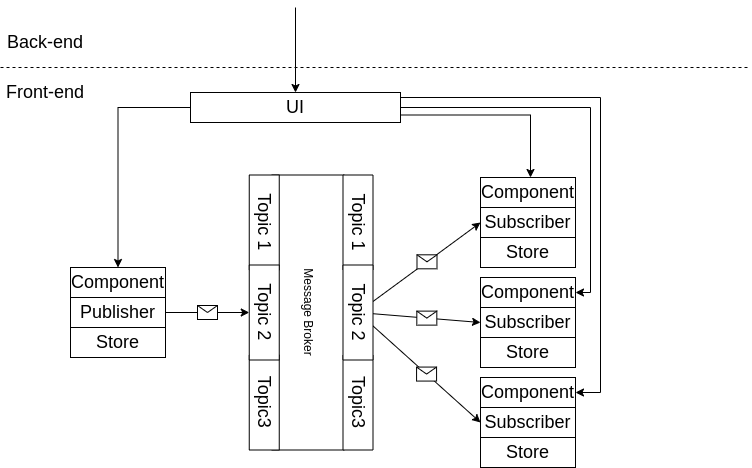
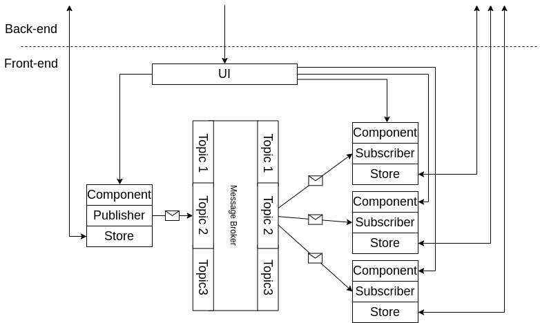
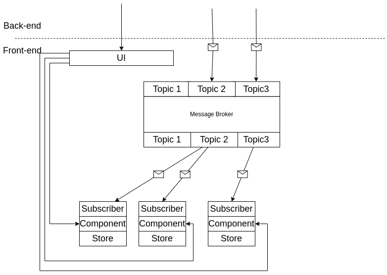

# Реактивные хранилища с EDA (event driven architecture)

Давайте попробуем немного улучшить подход к паттерну pub/sub в реактивной архитектуре. Да сами по себе подписки устраняют ненужные прямые связи между компонентами системы. В примере из прошлой статьи, где кнопка публикует событие о том, что покупка совершена а необходимая часть системы подписана на это событие и может прореагировать прямой связи нет. Но есть косвенная. Часть системы должна подписаться на эти события, а для этого надо получить доступ к коду рядом с кнопкой. В зависимости от типа реализации это может быть в качестве примера в простейшем случае для DOM объект кнопки на который мы вешаем обработчик). Да, прямой связи нет, но в коде эта косвенная зацеплённость будет иметь место и это делает систему менее готовой к изменениям. Можем ли мы избавиться от косвенной связи тоже? Конечно! Используем проверенный подход с использованием брокера сообщений. Концептуальная схема приведена ниже:

*Рис.1 Архитектура с использование message broker*

Стрелки не обозначают прямое взаимодействие, в реализации в стрелках могут скрываться какие-то сервисные слои. Создаём некую глобальную сущность которая будет отвечать только за то чтобы принимать сообщения от кого бы то ни было и отправлять эти сообщения подписчикам. Если необходимо мы можем и довесить в неё дополнительное логирование, хранение, права доступа или дешифрование и пр. теперь связи между подписчиком и отправителем действительно нет. Этим очень удобно управлять. Для того чтоб не запутаться в сообщениях обычно группируют потоки сообщений по какому-нибудь признаку, это называется topic. Основная идея в данной архитектуре — реагировать только на высокоуровневые глобальные события в системы, а не на локальные изменения состояний или события. Реализовать это можно например с помощью отдельного Web Worker, который обрабатывает сообщения, BroadcastChannelApi, кастомных Browser Events, и т. д.

` `Но везде есть подвох — наши компоненты обычно ещё могут общаться с сервером. Если дорисовать это с помощью стрелок, то картинка станет немного сложнее (Рис.2):

*Рис.2 Архитектура с использование message broker и взаимодействием с сервером*

Если с точки зрения синхронизации удалённого состояния компоненты слабо связаны, то этого может быть и достаточно, но зачастую сами сетевые запросы часто могут приводить или быть следствием протекания событий что создаёт каскады таких событий, особенно если используется ajax, вебсокеты, long polling или прочие механизмы асинхронного получения уведомлений с сервера. Можно настроить систему так, чтоб и данный канал работал через message bus, пример ниже (Рис. 3):

*Рис 3. Message broker как слой между внутренней и внешней системой*

По сути мы просто делаем message broker не только способом взаимодействия с внутренними частями системы, но и с внешними. Особенно хорошо эта техника подходит для больших приложений,когда мы хотим выделить дополнительный кеширующий слой, который будет обновляться по уведомлениям с сервера, это характерно для Progressive Web Applications (PWA). Часто именно так поступают в высоко интерактивных сетевых приложениях (трейдинг, игры). Из плюсов такого подхода:

1. Высокий уровень абстракции и завязка именно на бизнес-события, что делает приложение более понятным и управляемым с точки зрения реакции на изменения при хорошем понимании доменной области.
1. Отлично подходит для микрофронтендов, особенно если они собираются в рантайме (пример — webpack module federation, или аналоги), когда несколько команд должны работать над компонентами, которые будут использованы на одной странице и будут взаимодействовать. Данный подход навязывает интеграцию через события и становится  легче взаимодействовать с другими командами по поводу интеграции.

Основные минусы:

1. Это достаточно сложная и потому на сегодня не самая распространённая на front-end архитектура и для больших приложений нужно будет создавать много кастомных общих инструментов в том числе для мониторинга, дебага, управления. Что требует хорошего системного видения и высокой квалификации.
1. Высокий уровень абстракции (отсутствие прямых связей) так же требует определённой подготовки для работы с системой. Т.е. квалификация сотрудников.
1. Требуется время на изучение доменной области и на специфику работы системы.

Роль правильной архитектуры — делать работу приложения более прозрачным и предсказуемым за счёт введения дополнительных абстракций. Проблема в том, что сами абстракции добавляют сложности в понимании системы, особенно если эти абстракции не являются общеизвестными паттернами, что требует в любом случае более высокой квалификации или дополнительного инвестирования в обучение. Именно поэтому архитектура — это всегда балансирование между сложностью в системе и в абстракциях применяемых в этой системе. Этот выбор часто не простой, иногда даже спорный и правильность решения может изменяться во времени, а самое интересное, что если архитектор правильно делает свою работу и система будет работать прозрачно и предсказуемо, то это даже можно не заметить со стороны, так как будет просто казаться, что просто разработчики быстро делают свою работу. Но важность проектирования для больших систем для бизнеса не менее важна чем реализация бизнес-фич, так имеет значительное влияние на скорость разработки и количество проблем (багов) в будущем.
