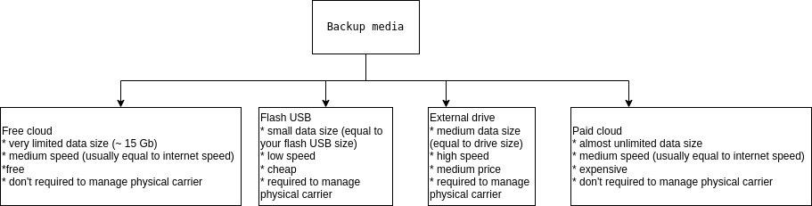
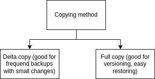

# Бэкапирование

Автоматическое периодическое бэкапирование (резервное хранение данных) - стандарт любой промышленной системы. Для многих пользователей это не обязательная процедура, но все-таки многие имеют некоторое количество данных которые хотелось сохранить при любых обстоятельствах. Наладить автоматическое или полуавтоматическое бэкапирование просто и доступно каждому. Пользователю доступно несколько принципиальных подходов к бэкапированию, но перед тем как их описать нужно сказать, что бэкапирование не будет эффективным если не будеит удовлетворять следующим требованиям.

## Требования к бэкапам:

1. Технологическая лёгкость создания бэкапа

2. Быстрая скорость создания / простота восстановления

3. Надежность носителя бэкапов

К счастью вопрос бэкапирования поднимается часто, поэтому обычно технологических проблем не возникает

## Перед бэкапирование 

Перед тем как начать создавать резевные копии нужно ответить на вопросы:

1. Что именно хотим бэкапировать (объем данных)

2. Где будем хранить бэкапы



*Рис 1. Виды носителей для хранения бэкапов*

3. Зачем мне бэкапы (бэкапирование данных / системы, скорость доступа, версии данных)?



*Рис 2. Принципиальные методы бэкапирования* 

На счет 3-его пункта нужно прояснить. Если мы бэкапируемся для того, чтоб защититься от потери данных в результате работы - то скорее всего нам не нужно бэкапирование системы, но может пригодится высокая скорость доступа к данным и создании нескольких версий таких копий. Если мы хотим защититься от поломки диска и хотим потом быстро мигрировать на новый компьютер, но вероятно подойдет бэкапирование всей системы. 

Ниже я опишу несколько подходов, которые сам использоал

## Подходы к бэкапированию: 

### Создание зашифроанного архива

Мне нравится использовать зашифроанные tar архивы которые можно делать мультипоточно (быстрее) прямо не выходя из системы для бэкапирования домашних директорий своих пользователей следующим образом (архивируем папку dir):

```
sudo tar ---use-compress-program="pigz -k" cf - dir | gpg -c > dir.tar.gz.gpg 
```

Для разархивирования такого архива потребуется следующая команда:

```
gpg -d dir.tar.gz.gpg | tar -xvzf -
```

### Delta клонирование данных с помощью rclone
Отличный способ для быстрого частого бэкапирования большого объема данных которые мало изменяются. Я использовал внешний диск для создания копии рабочих проектов (около 60 Gb), но для небольшого количества данных можно использовать и удаленные диски (например google drive). Я использовал скрипт в котором указывал что бэкапироать не нужно  (автогенерируемые директории node_modules, скрытые файлы и директории, содержимое директории snap)

```
#!/bin/bash

rclone -v sync "/home/myUser/" "/media/sdb/backups/myUser" \
--filter="- node_modules/**" \
--filter="- .*" \
--filter="- .*/**" \
--filter="- snap/**" \

```


### Создание образа сисемы с помощью dd

Прекрасный простой метод бэкапирования всей системы с сжатием (аккуратно, нельзя сохранять полученный образ на тот же диск с которого мы его получаем, во время создания для избежания зацикливания):

```
dd if=/dev/sda | gzip -9 > /mnt/external/filename.img.gz 
```

Для восстановления:

```
zcat /mnt/external/filename.img.gz | dd of=/dev/sda
```

### Создание полного образа системы с использованием clonezilla на внешнем носителе.

**Clonezilla** - прекрасный инстумент создания образов всего диска. Нужно будет просто установить нужную программу на внешний носитель и можно пользоваться! Это очень удобно делать с внешним объеным диском позволяющим хранить полученные образы прямо на нём и прямо с него разворачиваться.


