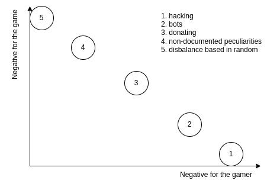

# Life-cheating 

## Виды читинга

Любой создатель игр знает на сколько важным фактором для становления игры как успешной является игровой баланс между ее участниками. Использование любых методов нарушающих нормальный геймплей (это и есть cheating) вызывает сильное раздражение у тех участников кто по каким-то причинам (техническая, моральная) не использует подобных методов. При этом обычный игрок будет выступать за некое "наказание" тех, кто использует cheat-методы, дабы сохранить интерес игры вернув ее таким образом в нормальный геймплей.Я выделяю пять типов cheat-методов:

1. hacking - сейчас встречается достаточно редко, но такая возможность была часто доступна раньше, когда использую некоторые незадокументированные технические возможностиможно получить преимущество в игре перед лругими участниками (взлом базы данных сервера с изменением некоторых данных, взлом локального клиента, инжекция скриптов, использование чит-кодов, взлом/модификаци hardware)

2. bots - установка "умного" ПО прожимающего за игрока нужные комбинации клавиш в нужное время часто с использование искусственного интеллекта или основанное на повторе некоторых действий.

3. donating - за определенную плату можно приобрести некоторые особенности, порой это дает некотороые преимущества (речь не о скинах или чем-то подобно, что практически не влияет на геймплей).

4. non-documented peculiarities (gmeplay disbalance) - некоторые баги или немного несбалансированные места (особо сильный артефакт\способность\персонаж\и т.д.) которые хоть и не являются сильно распространенными, но в тоже время о них известно открыто и большинство игроков пытаются эксплуатировать эту уязвимость.

5. disbalance based on random (можно разделить на дисбаланс на начальных условиях и в игровом процессе)- в игру вводится некоторая разнородность в виде разных начальных условий для разных игроков (точка появления\начальные навыки\специализации\ресурсы) и т.д. для повышения разнообразия. Но если дисперсия таких разнородностей слишком велика, это может сделать игру совершенно не интересной. Реально это не относиться к читингу, и от части это можно отнести к non-documented peculiarities, но я выношу в отдельный пункт из-за принципиально разной природы проявления и борьбе с данным cheat-методом.

## Что читинг делает хуже?

Обычная мера наказания в сетевых играх за использования cheat-методов:
1. hacking - полный или частичный бан персонажа или игрока. Даже при небольшом количестве проявлений (по моим оценкам даже меньше 1%) делают игру не привлекательной для честных игроков если нет возможности исключить или локализовать читеров. Обычно практически не вызывает плохих эмоций в отношении игры, но вызывает очень плохие эмоции по отношению к эксплуататорам (особенно если эксплуататор играет против нас).

2. bots -  полный или частичный бан персонажа или игрока. Даже при малом количестве проявлений (по моим оценкам даже меньше 1-3%) делают игру не привлекательной для честных игроков если нет возможности исключить или локализовать читеров. Люди относятся к такому виду читинга более снисходиттельно в основном из-за неспособности его распознать и из-за того, что зачастую это не даёт полного превосходства в игре и потому с этим можно справляться даже методами честного геймплея. Вызывает мало плохих эмоций в отношении игры, но достаточно много плохих по отношению к эксплуататорам

3. donating - люди относятся к такому виду читинка снисходительно до тех пор, пока он не даёт явных преимуществ, или пока с ним можна совладать с помощью игровых механик или навыков игрока. Но если это может дать преимущество, то вызывает негативные эмоции и по отношению к игроку и по отношению к игре.

4. non-documented peculiarities - обычно без наказания игрока. На ранних стадиях развития игры вся суть конкуренции между игроками сводиться к нахождению таких особенностей дающих преимущество и обеспечивающих превосходство и потому не осуждается игроками сильно, хотя и может вызывать осуждение. Но с развитием игрового мира такие несбалансированные места пропадают (изменяется система) так как эксплуатация такого рода особенностей может нарушать геймлей или сильно снижать его разнообразие для игроков. Наказание за использование таких особенностей обычно не применяется, но их наличие делает игру гораздо менее привлекательной для игроков и если их. Вызывает достаточно сильные негативные эмоции в отношении к игре и немного негативных по отношению к эксплуататорам

5. disbalance based on random - без наказания игрока. Но резко снижает привлекательность игры из-за потери чувтва контроля над игровым процессом. Вызывает сильные негатиыные эмоции в отношении игры и очень слабые негативные эмоции по отношению к эксплуататорам.

Это можно изобразить схематически на графике

*Pic. 1: Negative emotions maked by cheat methods.*

Причем следует заметить, что "non-documented peculiarities" и "disbalance based on random" это читинг на уровне культуры игроков, т.е. нет какого-либо формально доказательства того, что правила игры (gameplay) нарушены и границу для такого нарушения заранее очень сложно провести. Тем не менее она может ощущаться достаточно отчетливо.

## Ассоцация

Итак, самые отвратительные игры те - в которых мало что зависит от игрока и в которых отсутствует баланс, при этом игры в которых есть возможность использования методов hacking и bots более конфликтные с точки зрения игроков.

А теперь, проведем несколько аналогий:
1. hacking - действия приводящие к явному нарушению установленных законов или правил в системе.
2. bots - "умное" ПО и аппаратное обеспеченье позволяющее автоматизировать некоторые виды работ приносящих дополнительные ресурсы или дающие преимущество тем кто им обладает.
3. donating - лоббирование\коррупция.
4. non-documented peculiarities - использование "лазеек" в законах и правилах системы, обычно этим занимаются юристы, политики, бухгалтеры, серые бизнесмены и пр.
5. disbalance based on random - изначально разное положение учавствующих в системе + в связи с этим принципиально разные открывающиеся возможности для них.  

Будь наш мир игрой, она бы не была особо превликательной (даже не смотря на общую монотонность). Похоже мы научились относительно хорошо бороться только с первым пунктом и в некоторых государствах отчасти с третьим, и то, похоже, не особо учитывая самый высший слой игроков.

